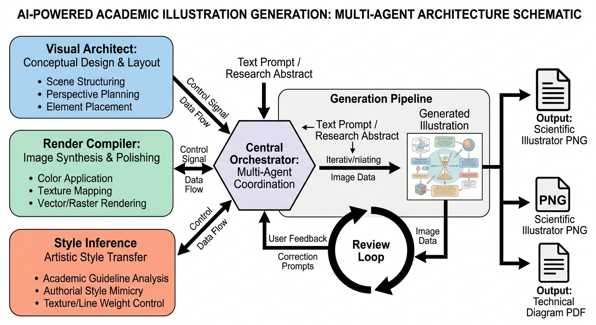

# AcademicDreamer



Multi-agent system for creating professional academic illustrations using a two-stage prompt compilation process.

## Overview

AcademicDreamer transforms academic concepts into CVPR/NeurIPS-level scientific illustrations through:

1. **Visual Schema Generation** - Analyzes paper content and selects appropriate layout strategy
2. **Style Compilation** - Fuses visual schema with venue-specific style directives
3. **Image Generation** - Produces high-fidelity illustrations via OpenRouter API
4. **Quality Review** - Iterative review loop with configurable iterations

## Installation

```bash
# Clone repository
git clone <repository-url>
cd academic-dreamer

# Install dependencies with uv
uv sync

# Copy environment template
cp .env.example .env

# Edit .env with your API key
```

## Usage

### JSON Input Schema

```json
{
  "idea": "The paper proposes a novel transformer architecture for image segmentation...",
  "style": "CVPR 2024",
  "target_type": "architecture_diagram",
  "control": {
    "max_iterations": 2,
    "output_formats": ["png"],
    "quality_threshold": 0.7
  }
}
```

| Field | Type | Required | Description |
|-------|------|----------|-------------|
| `idea` | string | Yes | Academic concept/paper content |
| `style` | string | Yes | Venue (CVPR, ICLR, NeurIPS, Nature) or free-form style |
| `target_type` | string | No | `infograph`, `architecture_diagram`, `flowchart`, `timeline` |
| `control` | object | No | Control arguments |

### CLI

```bash
# Basic usage
python -m academic_dreamer.cli --input request.json

# With overrides
python -m academic_dreamer.cli --input request.json --max-iterations 3 --output-formats png,pdf

# Specify output directory
python -m academic_dreamer.cli --input request.json --output-dir ./results
```

### Python API

```python
from academic_dreamer import generate_academic_illustration

result = await generate_academic_illustration(
    idea="The paper proposes a novel transformer architecture...",
    style="CVPR 2024",
    target_type="architecture_diagram",
    max_iterations=2,
    output_formats=["png", "pdf"],
)

print(result["output_paths"])
```

## Examples

See [examples/](examples/) for detailed usage examples:

- [CLI Example](examples/run.sh) - Using AcademicDreamer from command line
- [API Example](examples/api_example.py) - Using AcademicDreamer in a Python workflow

## Project Structure

```
academic_dreamer/
├── agents/              # Multi-agent implementations
│   ├── visual_architect.py   # Stage 1: Schema generation
│   ├── render_compiler.py     # Stage 2: Prompt compilation
│   └── style_inference.py    # LLM-based style inference
├── core/                # Core pipeline
│   ├── orchestrator.py        # LangGraph workflow
│   ├── generation_pipeline.py # Image generation
│   ├── review_iteration.py    # Quality review loop
│   ├── target_classifier.py   # Auto-detect target type
│   └── output_formatter.py    # PNG/PDF export
├── prompts/              # Prompt templates
│   ├── visual_schema.md
│   ├── render_compile.md
│   └── venues/           # Venue-specific styles
├── models/               # Data schemas
├── config/               # Configuration
├── cli.py                # CLI entry point
├── main.py               # API entry point
├── pyproject.toml
└── README.md
```

## Control Arguments

| Argument | Default | Description |
|----------|---------|-------------|
| `max_iterations` | 2 | Review iterations (0=skip) |
| `output_formats` | ["png"] | Output formats |
| `quality_threshold` | 0.7 | Quality gate (0.0-1.0) |

## Supported Venues

- CVPR
- ICLR
- NeurIPS
- Nature
- Custom (LLM-inferred)

## License

MIT
